# 软件工程实训报告

## 1.阅读和描述样例工程 & 2.标注样例工程中的代码

    参照ppt中的指示在github上接受了作业任务，并将任务导入了个人代码仓库中。
    之后详细阅读了代码，并基于javadoc先对样例工程中的原始代码进行了相应注释，并提交到github，parser类中的部分注释截图如下所示：
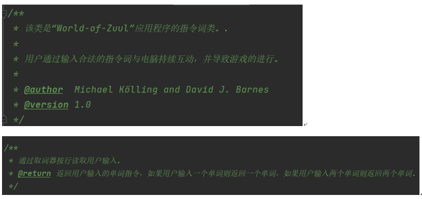

####
    然后，通过精读样例工程软件代码，我理解了样例工程的代码逻辑，并使用Enterprise Architect画出UML了类图：
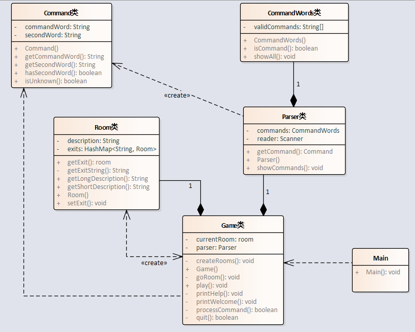

#### 
    至此，我对整个工程开发有了一个基本的了解，接下来就是按照ppt中的任务指示一步步完成整个实训任务。

## 3.改进和维护样例工程
>样例工程中存在的问题：
>在Game类的processCommand()方法中，当用户输入的命令被辨认出来以后，有一系列
>的if语句用来分派程序到不同的地方去执行。从面向对象的设计原则来看，这种解决方案
>不太好，因为每当要加入一个新的命令时，就得在这一堆if语句中再加入一个if分支，最
>终会导致这个方法的代码膨胀得极其臃肿。如何改进程序中的这个设计，使得命令的处理更
>模块化，且新命令的加入能更轻松？请描述你的解决思路，并对你的解决方案进行实现和测试。

###
    通过上网查阅相关资料[1]（参考文献见word报告），我找到了优化if else的设计模式的方案。
    通过阅读博客[1]中的相关内容，最终我采取了一种之前没有听说过的方案“策略模式+工厂方法消除if else”。
    在实际操作的过程中，发现由于每个操作实现起来的区别，不太方便结合“工厂”方法，于是乎改用抽象类代替“工厂”功能。

    首先，我把每个条件逻辑代码块，抽象成一个公共的抽象类Operation，可以得出以下代码：
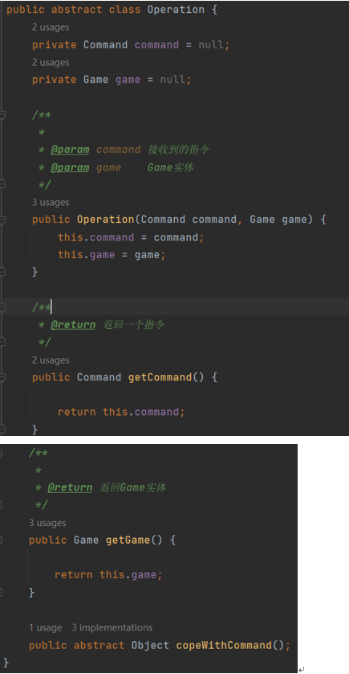
    
    接着我根据每个逻辑条件，定义相对应的操作策略实现类“go”，“help”，“quit”：
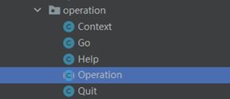
    
    例如help类中代码如下：
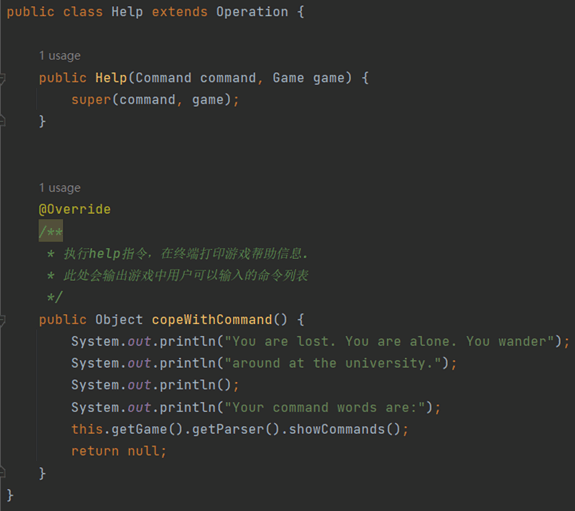

    最终，在每个Operation的子类中的copeWithCommand()方法一一对应原本在Game类中实现的方法。
    由此可见，这样就避免了每当要加入一个新的命令时，就得在这一堆if语句中再加入一个if分支而导致的代码膨胀臃肿问题。

## 4.扩充样例功能
>增加look功能
###
    扩展游戏，使得一个房间里可以存放任意数量的物件，每个物件可以有一个描述和一个重量值，
    玩家进入一个房间后，可以通过“look”命令查看当前房间的信息以及房间内的所有物品信息，
    如下所示：
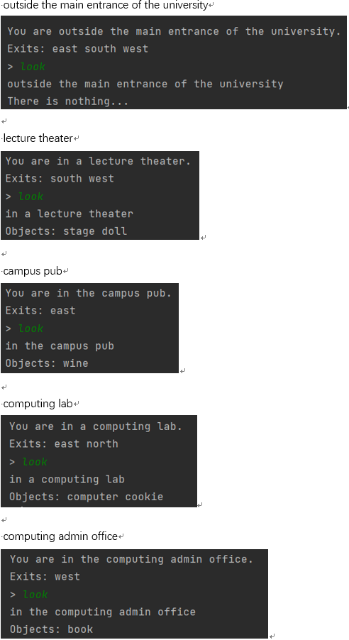

>增加back功能
###
    在游戏中实现一个“back”命令，玩家输入该命令后会把玩家带回上一个房间，
    具体操作如下所示：
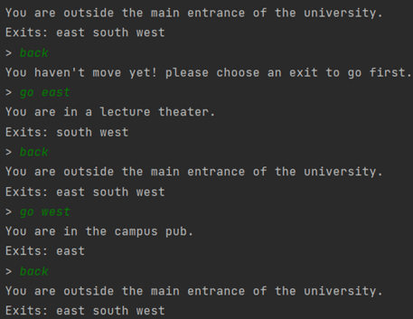

>新增room module，实现模块化设计。
###
    将Room类修改为抽象的工厂类，用来管理这些Room类的实现，
    并在各个房间中添加一些物品，再增加一个随机房间。
    通过将Room类抽象化为GeneralRoom，
    同时抽象出一个公共的接口RoomFactory用于生成新的房间，
    这样设计很好的避免的代码冗余问题，符合“高内聚，低耦合”设计原则。
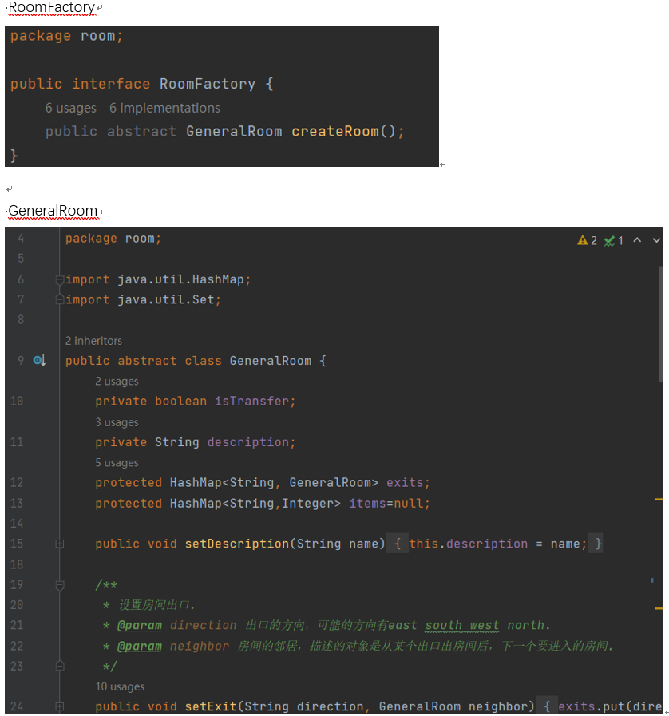

    经过上述重构，我把每个房间都单独设为一个类：
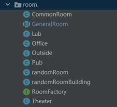
    
    例如，Lab房间类如下所示：
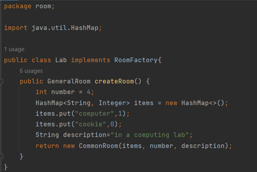

    随后将其余各个房间的基本信息也都定义在其自身的类中，
    这样设计的好处是，当需要修改某个房间的基本信息时，
    只需要对该房间对应的类进行修改即可，减少了修改代码时出错的可能性。

>新增player module
###
    在游戏中新建一个独立的Player类用来表示玩家，该类具有的属性如下：
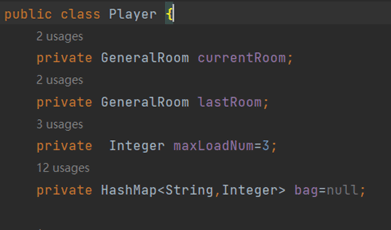

    currentRoom表示玩家当前所在房间；
    lastRoom表示玩家进入当前所在房间之前的所在的上一个房间，用于
    实现“back”操作；
    bag表示玩家的背包，背包中的物品具有物品名、重量两个属性；
    maxLoadNum表示最大负重量，玩家拾起房间内物品的重量不能超
    过该数值，同时玩家可以通过吃饼干操作来增加最大负重量。

>新增item功能
###
    在游戏中增加一个新的命令"items",可以打印出当前房间内所有的物件及总重量，
    以及玩家随身携带的所有物件及总重量。
    玩家进入各个房间时的打印信息如下：
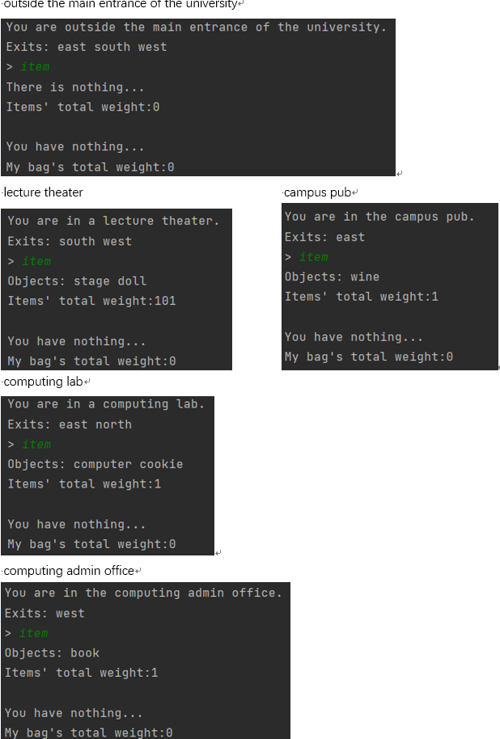

>增加take功能和drop功能
###
    在游戏中增加两个新的命令“take"和"“drop”，使得玩家可以拾取房间内的
    指定物品或丢弃身上携带的某件或全部物品，当拾取新的物件时超过了玩家可携带
    的重量上限，系统应给出提示。

    例如，进入computing admin office并拾起book时：
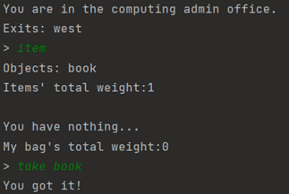

    成功取走物品。

    进入lecture theater并拾起stage时：
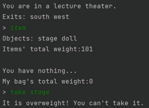

    取走物品失败，系统提示超重。

    进入pub拾起wine后，将其丢弃：
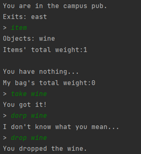

>增加eat cookie功能
###
    在某个或某些房间中随机增加一个magic cookie(魔法饼干）物件，
    并增加一个“eat cookie”命令，如果玩家找到并吃掉魔法饼干，
    就可以增长玩家的负重能力。

	例如，computing lab中有一块饼干，拾起并吃掉后可以增加玩家的负重能力：
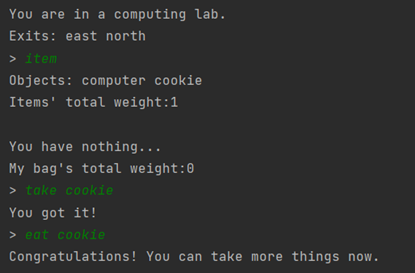

## 5.编写测试用例
>针对功能改进和扩充，在项目结构中编写单元测试用例，对代码执行单元测试。

###
    对RoomFactory接口进行测试：
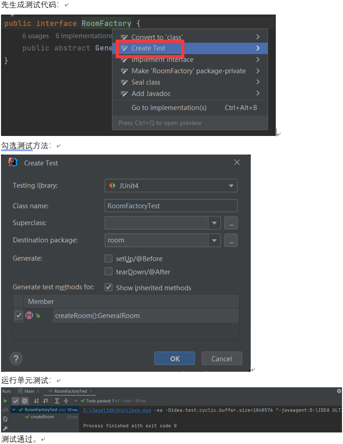
    
    采取上述相同方式对对GeneralRoom类进行测试：
    运行单元测试：
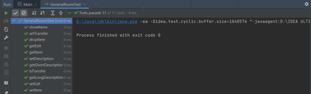
    
    测试通过。

    采取上述相同方式对对operation类进行测试：
    运行单元测试：
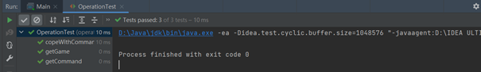

    测试通过。

## 6.代码提交情况
>由于网络原因，与远程仓库的连接时常不稳定。
>故我在每完成一部分内容后，都先将相关修改后的代码提交到本地仓库。

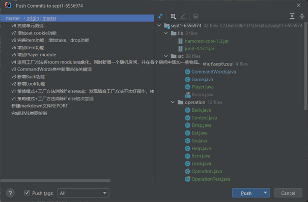